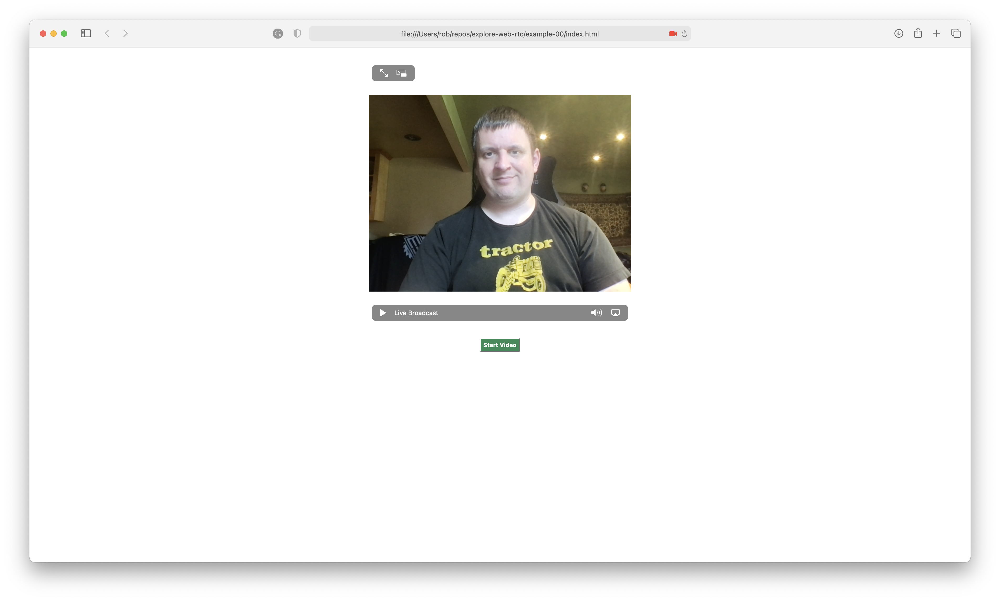

# Welcome

This example is based on the blog post [Data Stream from your Webcam and Microphone: Video Call with WebRTC Step 1](https://levelup.gitconnected.com/data-stream-from-your-webcam-and-microphone-videochat-with-javascript-step-1-29895b70808b)

This example demonstrates a lightweight HTML page containing two simple elements - a `video` element and a `button` to start video (or request access to your webcam and microphone):

